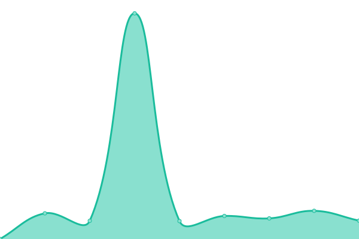

# [📈 Live Status](https://demo.upptime.js.org): <!--live status--> **🟩 All systems operational**

This repository contains the open-source uptime monitor and status page for [Hyung-Gyu Ryoo](http://hgryoo.github.io), powered by [Upptime](https://github.com/upptime/upptime).

With [Upptime](https://upptime.js.org), you can get your own unlimited and free uptime monitor and status page, powered entirely by a GitHub repository. We use [Issues](https://github.com/hgryoo/upptime-cubrid/issues) as incident reports, [Actions](https://github.com/hgryoo/upptime-cubrid/actions) as uptime monitors, and [Pages](https://demo.upptime.js.org) for the status page.

<!--start: status pages-->
<!-- This summary is generated by Upptime (https://github.com/upptime/upptime) -->
<!-- Do not edit this manually, your changes will be overwritten -->
<!-- prettier-ignore -->
| URL | Status | History | Response Time | Uptime |
| --- | ------ | ------- | ------------- | ------ |
|  [CUBRID Website ORG](https://www.cubrid.org/) | 🟩 Up | [cubrid-website-org.yml](https://github.com/hgryoo/upptime-cubrid/commits/HEAD/history/cubrid-website-org.yml) | 

 1911ms
     
 | 

<a href="https://hgryoo.github.io/upptime-cubrid/history/cubrid-website-org">79.71%</a>
    

|  [CUBRID Website COM](https://www.cubrid.com/) | 🟩 Up | [cubrid-website-com.yml](https://github.com/hgryoo/upptime-cubrid/commits/HEAD/history/cubrid-website-com.yml) | 

 2458ms
     
 | 

<a href="https://hgryoo.github.io/upptime-cubrid/history/cubrid-website-com">85.22%</a>
    

|  [CUBRID JIRA](http://jira.cubrid.org/) | 🟩 Up | [cubrid-jira.yml](https://github.com/hgryoo/upptime-cubrid/commits/HEAD/history/cubrid-jira.yml) | 

 1178ms
     
 | 

<a href="https://hgryoo.github.io/upptime-cubrid/history/cubrid-jira">100.00%</a>
    

|  [CUBRID QA Home](https://qahome.cubrid.org/) | 🟩 Up | [cubrid-qa-home.yml](https://github.com/hgryoo/upptime-cubrid/commits/HEAD/history/cubrid-qa-home.yml) | 

 1139ms
     
 | 

<a href="https://hgryoo.github.io/upptime-cubrid/history/cubrid-qa-home">100.00%</a>
    

|  [CUBRID DEV](https://dev.cubrid.org/) | 🟩 Up | [cubrid-dev.yml](https://github.com/hgryoo/upptime-cubrid/commits/HEAD/history/cubrid-dev.yml) | 

 777ms
     
 | 

<a href="https://hgryoo.github.io/upptime-cubrid/history/cubrid-dev">100.00%</a>
    

|  [CUBRID Manual](https://www.cubrid.org/manual/en/11.4/) | 🟩 Up | [cubrid-manual.yml](https://github.com/hgryoo/upptime-cubrid/commits/HEAD/history/cubrid-manual.yml) | 

 1867ms
     
 | 

<a href="https://hgryoo.github.io/upptime-cubrid/history/cubrid-manual">85.25%</a>
    

<!--end: status pages-->

[**Visit our status website →**](https://demo.upptime.js.org)

## 📄 License

- Powered by: [Upptime](https://github.com/upptime/upptime)
- Code: [MIT](./LICENSE) © [Anand Chowdhary](https://anandchowdhary.com), supported by [Pabio](https://pabio.com)
- Data in the `./history` directory: [Open Database License](https://opendatacommons.org/licenses/odbl/1-0/)
